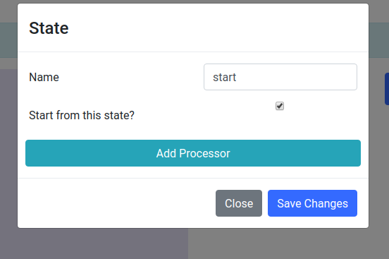
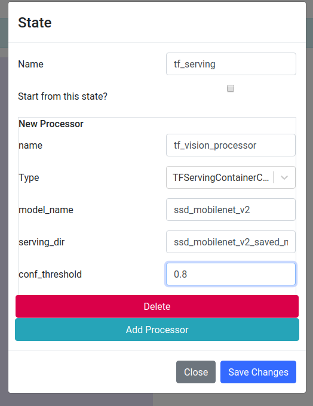
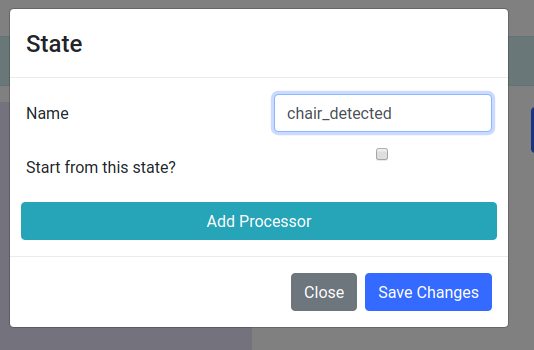
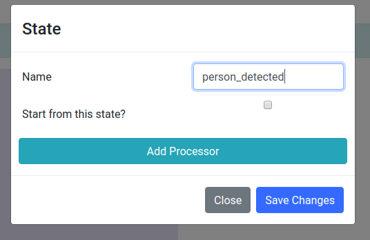
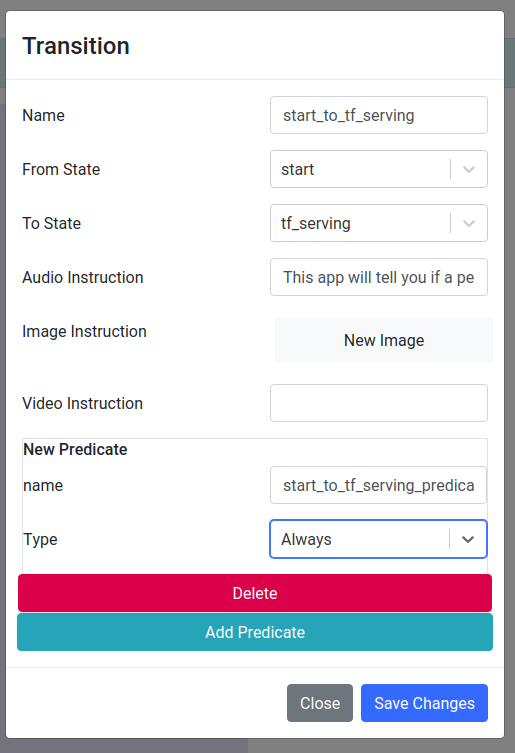
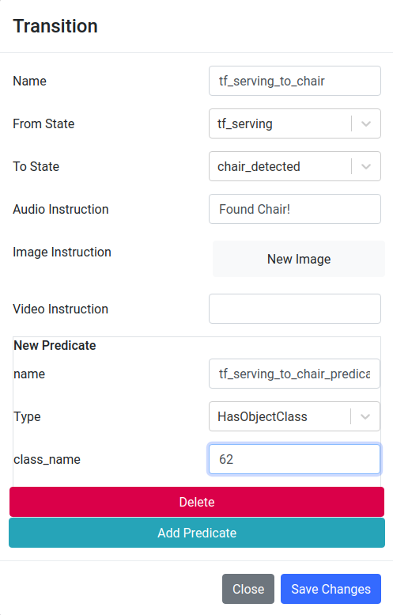
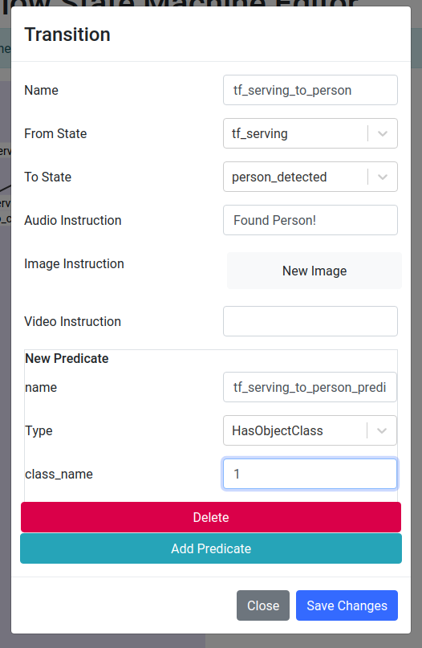
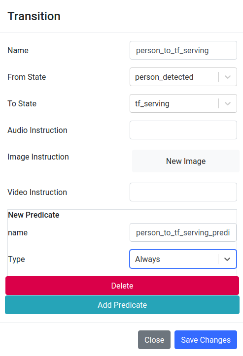
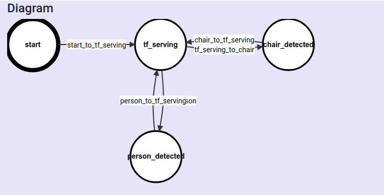

.. _tutorial:

Tutorial
**********************

We will create a wearable cognitive assistant that recognize a person or a chair
in this tutorial. First, let's get the example code running before going into
its implementation. 

1. `Install gabrieltool <https://openworkflow.readthedocs.io/en/latest/installation.html>`_. 
2. Download `gabriel_example.py <https://github.com/cmusatyalab/OpenWorkflow/blob/master/examples/gabriel_example.py>`_
   and the `object detector <https://storage.cmusatyalab.org/openworkflow/ssd_mobilenet_v2_saved_model.zip>`_
   into the same directory. This object detector is the SSD MobileNet v2 DNN
   from Tensorflow Object Detection API model zoo.
   In this example, we will use this object detector to detect people and
   chairs.
   
.. code-block:: console

    wget https://raw.githubusercontent.com/cmusatyalab/OpenWorkflow/master/examples/gabriel_example.py
    wget https://storage.cmusatyalab.org/openworkflow/ssd_mobilenet_v2_saved_model.zip

3. Unzip the downloaded object detector into the same directory.

.. code-block:: console

    unzip ssd_mobilenet_v2_saved_model.zip

4. Launch the gabriel server.

.. code-block:: console

    python ./gabriel_example.py run_gabriel_server

5. In the console, you should see log messages of building the FSM, starting
   gabriel server, and then launching a docker container. 
6. You should also be able to see the container started using docker commands.
   Note that it may take a few minutes to download the container image before the container is started.

.. code-block:: console

    docker ps -a --filter="name=GABRIELTOOL"

7. Once you see the container is up, the server is ready for connection. 
   Download `Gabriel client <https://play.google.com/store/apps/details?id=edu.cmu.cs.gabrielclient>`_
   from Android Play Store to connect to the server and try the application out. When the client has
   a person or a chair in view, the application should say "Found Person" or
   "Found chair" correspondingly.

8. Once you're done with the demo, make sure to clean up the created docker
   container with the following commands.

.. code-block:: console

    docker stop -t 0 $(docker ps -a -q --filter="name=GABRIELTOOL")

Now you've gotten the code running, let see what is happening under the hood. We
will focus on explaining how to create a gabriel server in the later half of
this tutorial. The example code contains a few more use cases of the gabrieltool
package. 

You can create the same FSM using either the gabrieltool python library or the
Web Editor. In general, the web GUI is good for simple applications while the
python library provides more flexibility and supports more customizable
application logic. Below we will create the same application using both methods.
If you prefer not to write any code, 
skip to `the Web Editor section <#using-openworkflow-state-machine-web-editor>`_.

Using Python Library
---------------------------

The FSM has two states. The first state is *st_start*. We want to
send a welcome message when a user first connects. Therefore, *st_start* doesn't
have any processing involved and will always transition immediately to the next
state and return a welcome message to the client.

The second state *st_tf* is the core of this application. When in this state,
input sensor data, which is an image in this example, is analyzed by our object
detector to see if there is a person or a chair. This is specified by a
fsm.Processor with a processor_zoo.TFServingContainerCallable. Since we want to
recognize either a person or a chair, we define two transitions, one for person,
another for chair. These transitions have predicates checking whether the person
or the chair object class exist in the output of our TFServingContainerCallable
processor. If a person is found, the person transition will be taken and return
an instruction of 'Found Person' to the Gabriel client. 

.. code-block:: python
   :linenos:

    import cv2
    import fire
    from logzero import logger
    from gabriel_server.local_engine import runner as gabriel_runner
    from gabrieltool.statemachine import fsm, predicate_zoo, processor_zoo, runner

    def _build_fsm():
        """Build an example FSM for detecting a person or a chair.

        Returns:
            gabrieltool.statemchine.fsm.State -- The start state of the generated FSM.
        """
        st_start = fsm.State(
            name='start',
            processors=[],
            transitions=[
                fsm.Transition(
                    name='tran_start_to_proc',
                    predicates=[
                        fsm.TransitionPredicate(
                            callable_obj=predicate_zoo.Always()
                        )
                    ],
                    instruction=fsm.Instruction(audio='This app will tell you if a person or a chair is present.')
                )
            ]
        )

        st_tf = fsm.State(
            name='tf_serving',
            processors=[fsm.Processor(
                name='proc_start',
                callable_obj=processor_zoo.TFServingContainerCallable('ssd_mobilenet_v2',
                                                                    'ssd_mobilenet_v2_saved_model',
                                                                    conf_threshold=0.8
                                                                    )
            )],
            transitions=[
                fsm.Transition(
                    name='tf_serving_to_tf_serving_person',
                    predicates=[
                        fsm.TransitionPredicate(
                            # person id is 1 in coco labelmap
                            callable_obj=predicate_zoo.HasObjectClass(class_name='1')
                        )
                    ],
                    instruction=fsm.Instruction(audio='Found Person!')
                ),
                fsm.Transition(
                    name='tf_serving_to_tf_serving_chair',
                    predicates=[
                        fsm.TransitionPredicate(
                            # You can also use the custom transition predicate we
                            # created in _add_custom_transition_predicate here. e.g.
                            # callable_obj=predicate_zoo.HasChairClass()
                            callable_obj=predicate_zoo.HasObjectClass(class_name='62')
                        )
                    ],
                    instruction=fsm.Instruction(audio='Found Chair!')
                )
            ]
        )

        # We need the state objects to mark the destinations of transitions
        st_start.transitions[0].next_state = st_tf
        st_tf.transitions[0].next_state = st_tf
        st_tf.transitions[1].next_state = st_tf
        return st_start

The *st_tf* state could also use a custom transition predicate defined by the following
function. To learn more about the how to use and create custom FSM processors
and transition predicates, see its
`API documentation <https://openworkflow.readthedocs.io/en/latest/source/gabrieltool.statemachine.html#module-gabrieltool.statemachine.fsm>`_.

.. code-block:: python
   :linenos:

    def _add_custom_transition_predicates():
        """Here is how you can add a custom transition predicate to the predicate zoo

        See _build_fsm to see how this custom transition predicate is used
        """

        from gabrieltool.statemachine import callable_zoo

        class HasChairClass(callable_zoo.CallableBase):
            def __call__(self, app_state):
                # id 62 is chair
                return '62' in app_state

        predicate_zoo.HasChairClass = HasChairClass

The gabriel cognitive engine is created using a `FSM cognitive engine runner <https://openworkflow.readthedocs.io/en/latest/source/gabrieltool.statemachine.html#module-gabrieltool.statemachine.runner>`_.

.. code-block:: python
   :linenos:

    def run_gabriel_server():
        """Create and execute a gabriel server for detecting people.

        This gabriel server uses a gabrieltool.statemachine.fsm to represents
        application logic. Use Gabriel Client to stream images and receive feedback.
        """
        logger.info('Building Person Detection FSM...')
        start_state = _build_fsm()
        logger.info('Initializing Cognitive Engine...')
        # engine_name has to be 'instruction' to work with
        # gabriel client from App Store. Someone working on Gabriel needs to fix this.
        engine_name = 'instruction'
        logger.info('Launching Gabriel server...')
        gabriel_runner.run(
            engine_setup=lambda: runner.BasicCognitiveEngineRunner(
                engine_name=engine_name, fsm=start_state),
            engine_name=engine_name,
            input_queue_maxsize=60,
            port=9099,
            num_tokens=1
        )

Gabrieltool currently doesn't support cleaning up the launched containers
automatically. You can stop and remove all gabrieltool related containers
using the following command.

.. code-block:: console

    docker stop -t 0 $(docker ps -a -q --filter="name=GABRIELTOOL")

Using OpenWorkflow State Machine Web Editor
---------------------------------------------------

Let's use the `Web Editor <https://cmusatyalab.github.io/OpenWorkflow/>`_ to create
the same application. 

First, let's create states. Go to Add >> State.

start state: 

- name: "start"
- Check Start from this state. 

tf_serving state: 

- name: "tf_serving"
- add a new processor

    - name: "tf_vision_processor"
    - type: "TFServingContainerCallable"
    - model_name: "ssd_mobilenet_v2"
    - serving_dir: "ssd_mobilenet_v2_saved_model". This is directory of the
      downloaded and unzipped model.
    - conf_threshold: 0.8

chair_detected state: 

- name: "chair_detected"

person_detected state: 

- name: "person_detected"

Now, let's add transitions. Go to Add >> Transition

start to tf_serving

- name: "start_to_tf_serving"
- From State: start
- To State: tf_serving
- Audio Instruction: "This app will tell you if a person or a chair is present."
- Add Predicate

    - name: "start_to_tf_serving_predicate"
    - type: Always

tf_serving to chair_detected

- name: "tf_serving_to_chair"
- From State: tf_serving
- To State: chair_detected
- Audio Instruction: "Found Chair!"
- Add Predicate

    - name: "tf_serving_to_chair_predicate"
    - type: HasObjectClass
    - class_name: 62

chair_detected back to tf_serving

- name: "chair_to_tf_serving"
- From State: chair_detected
- To State: tf_serving
- Add Predicate

    - name: "chair_to_tf_serving_predicate"
    - type: Always

.. image:: img/chair_to_tf_serving.png

tf_serving to person_detected

- name: "tf_serving_to_person"
- From State: tf_serving
- To State: person_detected
- Audio Instruction: "Found Person!"
- Add Predicate

    - name: "tf_serving_to_person_predicate"
    - type: HasObjectClass
    - class_name: 1

person_detected back to tf_serving

- name: "person_to_tf_serving"
- From State: person_detected
- To State: tf_serving
- Add Predicate

    - name: "person_to_tf_serving_predicate"
    - type: Always

By now, we have finished creating the FSM. The complete FSM looks as 
follows.

Let's export the FSM to the same directory of our object detector. 
The directory structure should look like the following.

.. code-block:: 

    ├── ssd_mobilenet_v2_saved_model
    │   └── 00001
    │       ├── saved_model.pb
    │       └── variables
    └── app.pbfsm

Gabrieltool CLI provides a convenient command-line tool to launch a gabriel
server with the exported FSM. Connect Gabriel Client to your server. When you
point the client to a person or a chair, the application should say "Found
Person" or "Found chair" correspondingly.

.. code-block:: console

    gbt run ./app.pbfsm

Once you're done with the demo, make sure to clean up the created docker
container with the following commands.

.. code-block:: console

    docker stop -t 0 $(docker ps -a -q --filter="name=GABRIELTOOL")